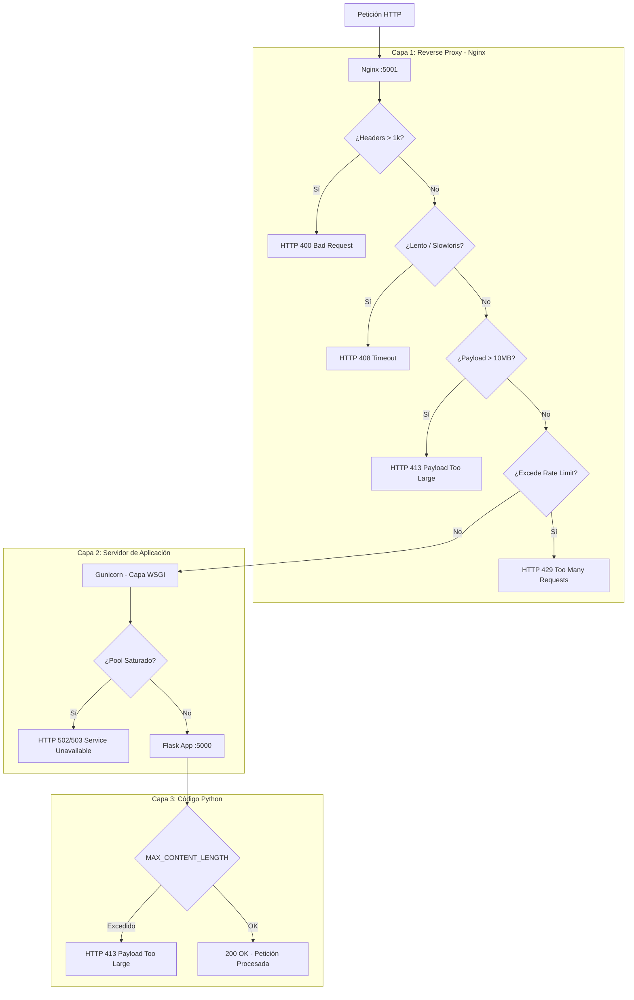

# Demo CWE-770: Allocation of Resources Without Limits or Throttling

Laboratorio local en Docker para comparar un servidor **vulnerable** contra uno **mitigado**, ambos limitados en contenedor (256MB RAM sin swap, 1 CPU) para evidenciar cómo las defensas a nivel de código previenen el colapso del sistema.

Uso exclusivo en entorno aislado (VM Kali + Docker).

---

## Estructura del Proyecto

```text
cwe770-demo/
├── docker-compose.yml # Configuración de límites (256MB RAM, memswap_limit: 256m)
├── vulnerable/        # Puerto 5000: Sin límites de payload, rate limit ni concurrencia
├── fixed/  # Puerto 5001: Nginx (Reverse Proxy) + Gunicorn + Flask (Defensa en Profundidad)
├── loadtest/          # Script de prueba (load_test.py) invocado internamente por el backend
└── dashboard/         # Puerto 8000: Interfaz HTML/JS y backend Flask (docker-py)

```

---

## 1. Levantar el laboratorio

Desde la carpeta raíz `cwe770-demo/`, construye e inicia los servicios:

```bash
docker compose up --build -d

```

Verifica la respuesta inicial de los tres contenedores:

```bash
curl http://localhost:5000/health   # Vulnerable
curl http://localhost:5001/health   # Fixed
curl http://localhost:8000          # Interfaz de Monitoreo

```

---

## 2. Uso de la Interfaz Web (Puerto 8000)

Accede mediante el navegador a: **`http://localhost:8000`**

### Funcionalidades de la Interfaz:

* **Monitoreo de Estado:** Tarjetas visuales que muestran en tiempo real si cada contenedor está `RUNNING` u `OFFLINE`/`EXITED` (consultando `/api/status` cada 2 segundos).
* **Parámetros Configurables:** Permite ajustar dinámicamente el objetivo (**Vulnerable 5000** o **Fixed 5001**), la cantidad de peticiones, nivel de concurrencia y el tamaño del payload (MB).
* **Registros en Tiempo Real:** Consola integrada que transmite la ejecución del ataque mediante *Server-Sent Events* (SSE).
* **Restauración del Entorno:** Botón **"Reiniciar Contenedores"** para recuperar los servicios caídos por *OOM-kill* a través de llamadas directas a la API de Docker.

---

## 3. Demostración de Ataque (CWE-770)

Para recrear la vulnerabilidad desde el formulario de la interfaz:

1. Selecciona el objetivo **Vulnerable (5000)**.
2. Ingresa los parámetros de ataque (ejemplo: `Peticiones: 150`, `Concurrencia: 60`, `Payload: 6 MB`).
3. Presiona **"Ejecutar Carga"**.
4. **Resultado:** El contenedor `cwe770-vulnerable` agotará los 256MB de RAM inmediatamente. Su badge cambiará automáticamente a **`EXITED`** o **`OFFLINE`**.
5. Cambia el objetivo a **Fixed (5001)** y lanza la misma prueba.
6. **Resultado**: El servidor mitigado descartará la ráfaga con respuestas HTTP `413` (Payload excesivo), `429` (Rate limit por IP) o `502`/`503` (Saturación de proxy/workers), manteniéndose en estado **`RUNNING`**.
7. Presiona **"Reiniciar Contenedores"** para restaurar el entorno vulnerable y repetir las pruebas.

---

## 4. Análisis Técnico del Fallo

Al estar deshabilitado el swapping a nivel de Docker Compose (`memswap_limit: 256m`), la falta de validación en el servidor vulnerable desencadena una expulsión por falta de memoria gestionada por el kernel.

Puedes auditar el motivo del colapso ejecutando en la terminal del host:

```bash
docker inspect cwe770-vulnerable --format='{{.State.OOMKilled}}' # Devuelve: true
docker inspect cwe770-vulnerable --format='ExitCode={{.State.ExitCode}}' # Devuelve: 137

```

---

## 5. Limpieza del Entorno

Para detener y limpiar todos los recursos de la demo:

```bash
docker compose down

```

---

## Resumen de Mitigaciones

| Factor de Control | Servidor Vulnerable (:5000) | Servidor Fixed (:5001) |
| --- | --- | --- |
| **Arquitectura** | Flask (Werkzeug dev server) | Nginx (Proxy) + Gunicorn + Flask |
| **Límite de Payload** | Sin control (Satura RAM) | client_max_body_size (Nginx) y MAX_CONTENT_LENGTH (Flask) |
| **Rate Limiting / Throttling** | Sin control | limit_req_zone por IP a nivel de Nginx |
| **Control de Concurrencia** | Sin control | Proceso acotado en Gunicorn (-w 2 --threads X)
| **Protección Protocolo HTTP** | Vulnerable a Slowloris / Headers | Timeouts e inspección de buffers en Nginx
| **Resistencia a OOM** | Caída por OOM-kill (ExitCode: 137) | Estable (Rechazos HTTP 413 / 429 / 502 / 503)


## Filtros aplicados en fixed
